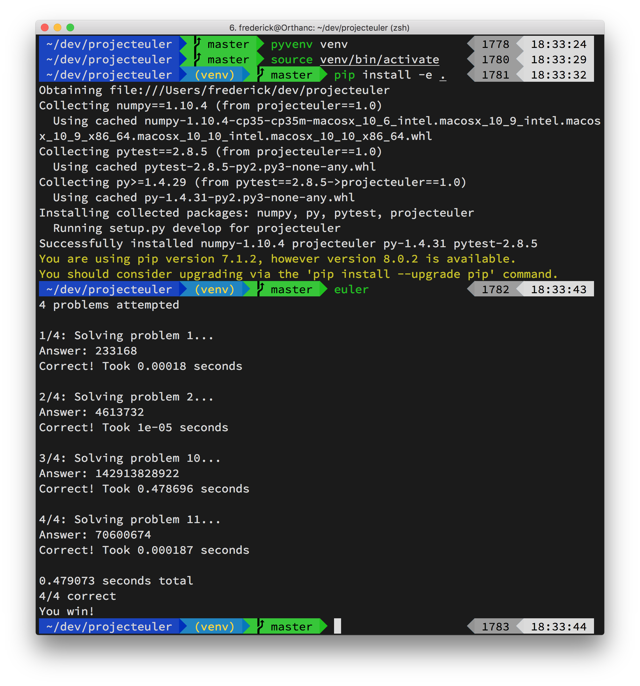

# Spoiler Alert!

This repository contains solutions to selected Project Euler problems.

No peeking unless you've already solved them.

You have been warned!

## Setup

Requires Python 3.5.

```
git clone git@github.com:doctaphred/projecteuler.git
cd projecteuler
pyvenv venv
source venv/bin/activate  # Or appropriate script for your shell
pip install -e .  # -e allows code changes to be reflected immediately
euler
```


